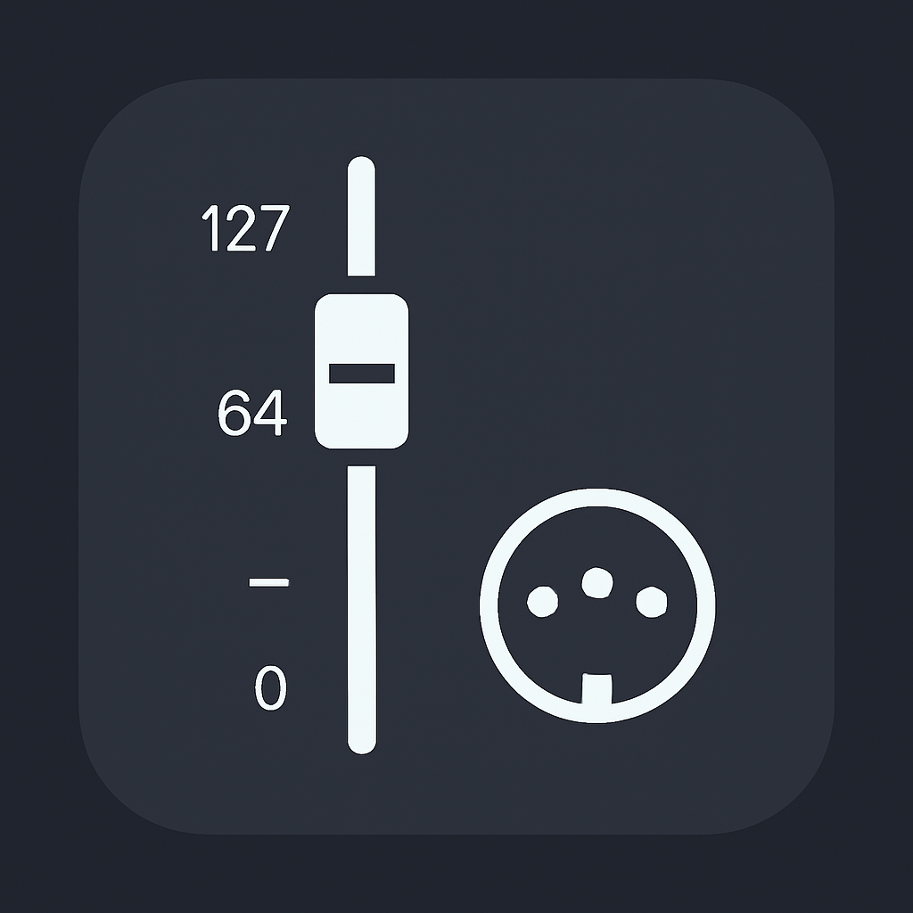

# MIDI CC Controller

# midi-cc-controller-windows-linux
Proyecto de midi-cc-controller compilado para windows, con las dll necesarias para compilacion y uso de la aplicacion.
Hubo que hacer cambios en los include de fltk por los de la version de la dll compilada, por lo que pueden haber errores pero en la ejecucion.
